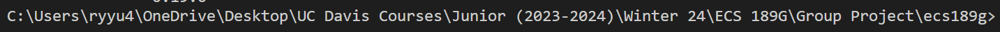
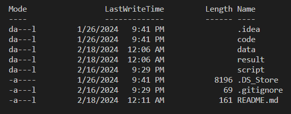

# ECS 189G: Deep Learning

## Group Members: Aditya Seth, Brian Li, Parth Pawar, Ryan Yu

## Pre-Execution Setup
Install the following packages with pip if you do not have them already.
- pytorch
- numpy
- torchvision (needed for stage 3)
- matplotlib
-  scikit-learn & scikit-image

## Execution Instructions
1. Open up a new terminal
2. Navigate to the root directory where code, data, result, and script can be seen

3. Execute the following command based on what you want to run: `python -m script.stage_(num)_script.script_(script_name)`.
   - Replace num with the stage num (i.e 3)
   - Replace script_name with the desired script (i.e cifar)
   - Supported commands:
      - MNIST: `python -m script.stage_3_script.script_mnist`
      - CIFAR-10: `python -m script.stage_3_script.script_cifar`
      - ORL: `python -m script.stage_3_script.script_orl`
